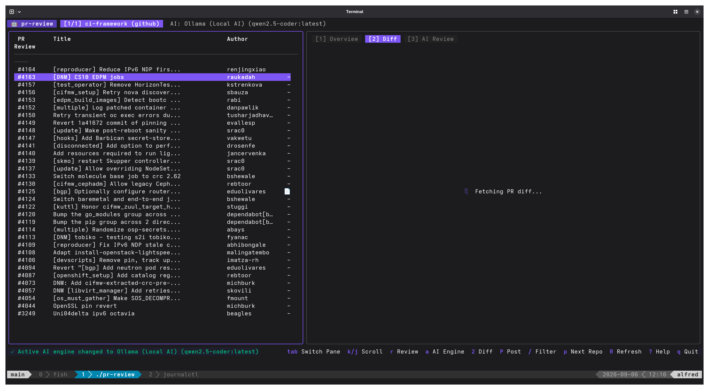
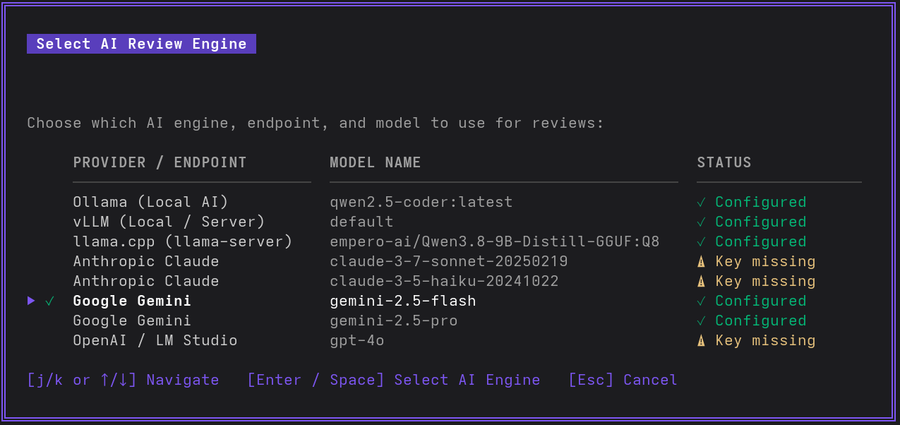
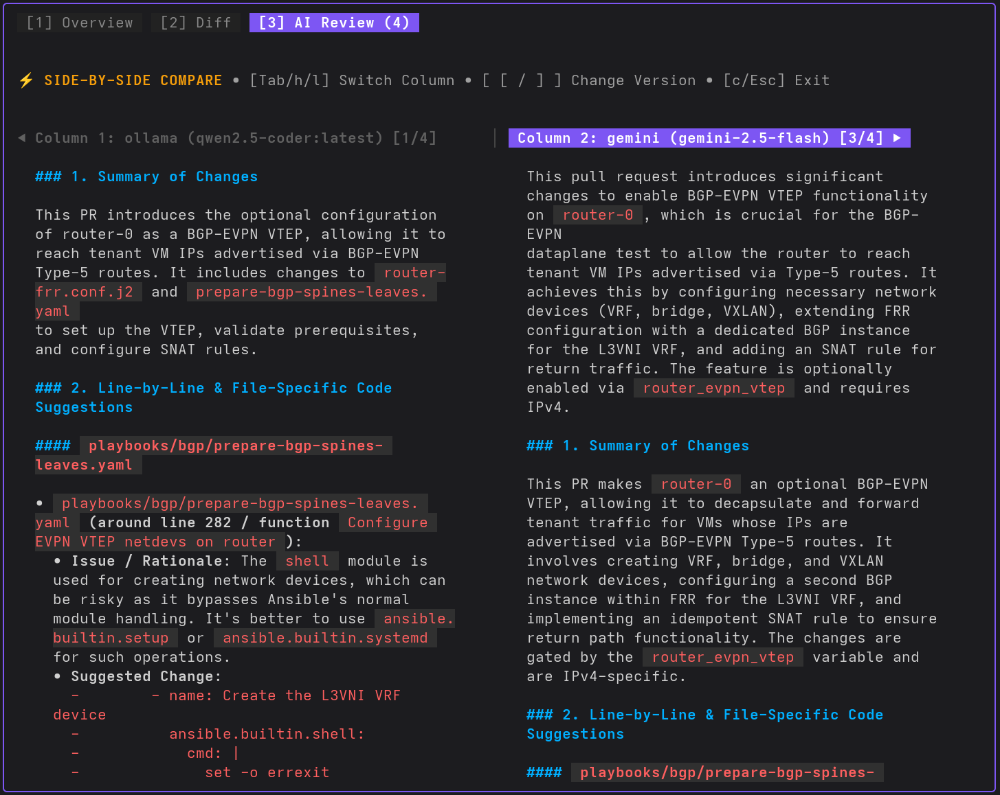
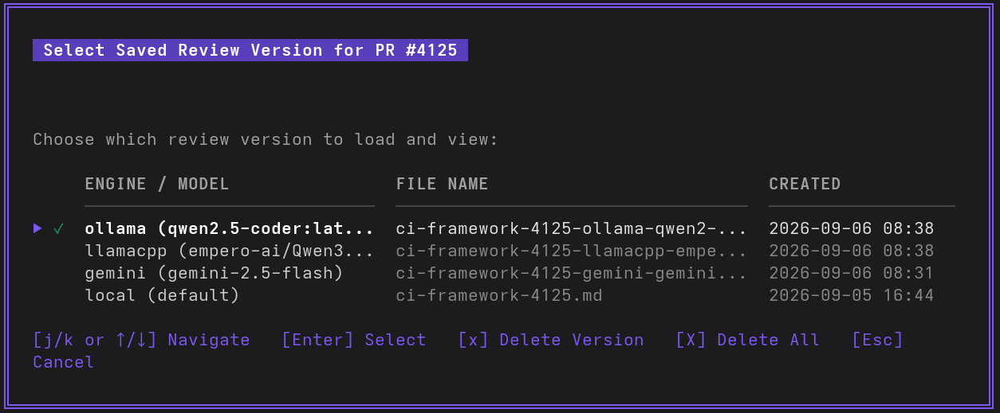

# 🖥️ Interactive Terminal UI (TUI) Dashboard

The `pr-review` Terminal User Interface allows you to browse repositories, inspect pull request diffs, trigger AI reviews on demand, compare reviews from multiple models side-by-side, and post review comments to GitHub/GitLab directly from your terminal.



---

## 🚀 Launching the TUI

To launch the dashboard, run:

```bash
# Launch default interactive dashboard
pr-review

# Or explicitly:
pr-review tui

# Override default AI provider on startup:
pr-review --provider vllm --model Qwen/Qwen2.5-Coder-32B-Instruct
```

---

## 🗂️ Dashboard Layout

The TUI is divided into two primary panes:

1. **Left Pane (PR List)**:
   - Displays all open pull requests/merge requests for the active project.
   - Shows PR #, title, author, labels, and cached review badge `[Cached]` if an AI review already exists on disk.
   - Live search/filtering via `/`.

2. **Right Pane (Details & Views)**:
   - **Tab 1: Overview (`1`)**: Shows metadata, description, branch info, and review status.
   - **Tab 2: Diff (`2` or `d`)**: Full syntax-highlighted git diff with viewport scrolling.
   - **Tab 3: AI Review (`3`)**: Rich rendered Markdown review generated by AI.

---

## 🤖 Selecting AI Review Engines & Models

Press <kbd>a</kbd> anywhere in the TUI to open the **AI Review Engine Selector**:



### Features:
- **Clean Table Layout**: Fixed-width columns for Provider/Endpoint, Model Name, and Status.
- **Active Engine Indicator**: Current active AI model is marked with a green `✓`.
- **Configuration Status**: Displays `✓ Configured` or `⚠ Key missing`.
- **Keyboard Controls**:
  - <kbd>↑</kbd> / <kbd>↓</kbd> or <kbd>k</kbd> / <kbd>j</kbd>: Navigate through available models.
  - <kbd>Enter</kbd> or <kbd>Space</kbd>: Select active AI engine and close modal.
  - <kbd>Esc</kbd>: Dismiss modal.

---

## ⚡ Side-by-Side Review Comparison

When you have generated reviews using different AI providers (e.g. comparing **vLLM / Qwen 32B** vs **Anthropic Claude 3.7 Sonnet**), press <kbd>c</kbd> to toggle **Side-by-Side Comparison Mode**:



### Key Controls in Comparison Mode:
- <kbd>[</kbd> / <kbd>]</kbd>: Cycle through saved review versions in the left and right columns.
- <kbd>Tab</kbd>: Switch active focus between the left and right review column.
- <kbd>P</kbd>: Post the review comment from the **currently active column** directly to the remote PR.
- <kbd>c</kbd>: Exit comparison mode back to the single review pane.

---

## 📜 Review Versions & History Modal

Press <kbd>v</kbd> to open the **Review Version Selector** modal:



### Capabilities:
- View all timestamped cached reviews generated for the selected PR.
- Press <kbd>Enter</kbd> to load and view any saved version.
- Press <kbd>x</kbd> to delete the currently selected review file from disk.
- Press <kbd>X</kbd> to delete all cached reviews for this PR.

---

## ⌨️ Complete Keybindings Reference

| Key | Action |
| :--- | :--- |
| <kbd>j</kbd> / <kbd>↓</kbd> | Move down line-by-line / select next PR |
| <kbd>k</kbd> / <kbd>↑</kbd> | Move up line-by-line / select previous PR |
| <kbd>Ctrl+d</kbd> / <kbd>Ctrl+u</kbd> | Half-page scroll down / up (vim style) |
| <kbd>Ctrl+f</kbd> / <kbd>Ctrl+b</kbd> | Full page scroll down / up |
| <kbd>g</kbd> / <kbd>G</kbd> | Jump to top / bottom of viewport |
| <kbd>Tab</kbd> | Switch focus between PR list and Details pane (or switch column in compare mode) |
| <kbd>1</kbd> | Switch to **Overview** tab |
| <kbd>2</kbd> / <kbd>d</kbd> | Switch to **Diff** tab |
| <kbd>3</kbd> | Switch to **AI Review** tab |
| <kbd>r</kbd> | Generate (or re-generate) AI review using the active engine |
| <kbd>P</kbd> | Post AI review comment to remote PR (with confirmation dialog) |
| <kbd>a</kbd> | Open **AI Engine / Model selector modal** |
| <kbd>v</kbd> | Open **Saved Review Versions modal** |
| <kbd>[</kbd> / <kbd>]</kbd> | Cycle to previous / next review version |
| <kbd>c</kbd> | Toggle **Side-by-Side Review Comparison mode** |
| <kbd>x</kbd> | Delete currently viewed review version from cache |
| <kbd>X</kbd> | Delete all cached review versions for this PR |
| <kbd>p</kbd> | Switch to next configured project/repository |
| <kbd>R</kbd> | Refresh PR list from remote git provider |
| <kbd>/</kbd> | Live filter / search pull requests |
| <kbd>?</kbd> | Toggle keyboard shortcuts help modal |
| <kbd>q</kbd> / <kbd>Ctrl+c</kbd> | Quit application |
