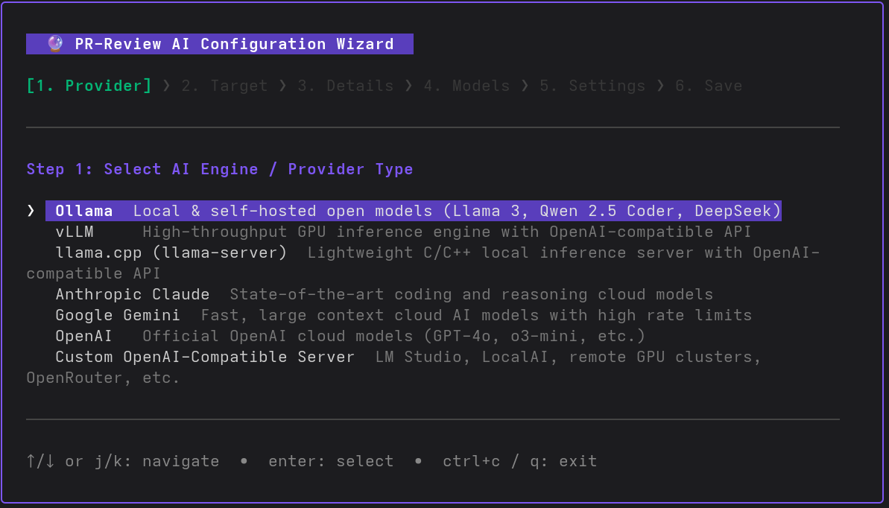

# 🔮 AI Configuration Wizard

The interactive configuration wizard allows you to easily configure AI providers, remote servers/endpoints, and models without manually editing YAML configuration files.



---

## 🚀 Launching the Wizard

Run any of the following commands:

```bash
# Launch the interactive wizard
pr-review wizard

# Or via command aliases
pr-review wizzard
pr-review config wizard
pr-review add-provider

# Target a specific configuration file:
pr-review wizard --config ~/.config/pr-review/config.yaml
```

---

## 📋 Step-by-Step Walkthrough

The wizard guides you through 6 sequential steps:

### 1. Select AI Engine / Provider Type
Choose from the list of supported providers:
- **Ollama**: Local & self-hosted open models (Llama 3, Qwen 2.5 Coder, DeepSeek)
- **vLLM**: High-throughput GPU inference engine with OpenAI-compatible API
- **llama.cpp**: Lightweight C/C++ inference server (`llama-server`)
- **Anthropic Claude**: Official Claude cloud models (Claude 3.7 Sonnet, Haiku)
- **Google Gemini**: Gemini 2.5 Flash, Pro cloud models
- **OpenAI**: GPT-4o, o3-mini, etc.
- **Custom OpenAI-Compatible Server**: LM Studio, LocalAI, remote GPU servers

### 2. Choose Configuration Target
- **Standard Provider (`ai.<provider>`)**: Configures the primary provider instance in `config.yaml`.
- **Custom Named Endpoint (`ai.endpoints`)**: Creates a dedicated named endpoint (e.g. `gpu1-vllm`, `remote-ollama`), allowing you to configure multiple instances of the same provider.

### 3. Endpoint Identity & Connection
- **Endpoint ID & Name**: Define a CLI alias (e.g. `gpu1-vllm`) and a friendly display name (e.g. `GPU 1 (DeepSeek Coder)`).
- **Base URL**: Pre-populated with provider defaults (e.g. `http://localhost:8000/v1` for vLLM, `http://localhost:11434` for Ollama).
- **API Key**: Enter token or environment variable placeholders (e.g. `${ANTHROPIC_API_KEY}`, `${VLLM_API_KEY}`).

### 4. Interactive Model Selection
- Browse a checklist of recommended models and toggle selections with <kbd>Space</kbd>.
- Type custom model identifiers into the custom model input box and press <kbd>Enter</kbd> to add them.

### 5. Parameters & Defaults
- **Temperature**: Sampling temperature (default: `0.2`).
- **Make Default**: Toggle whether to set this new provider/endpoint as the `default_ai_provider`.

### 6. Review & Save
- Displays a clean confirmation card with masked secrets.
- Select `[ 💾 Save & Apply ]` to persist the configuration directly to `config.yaml`.
- Preserves all unexpanded `${ENV_VAR}` placeholders safely.
